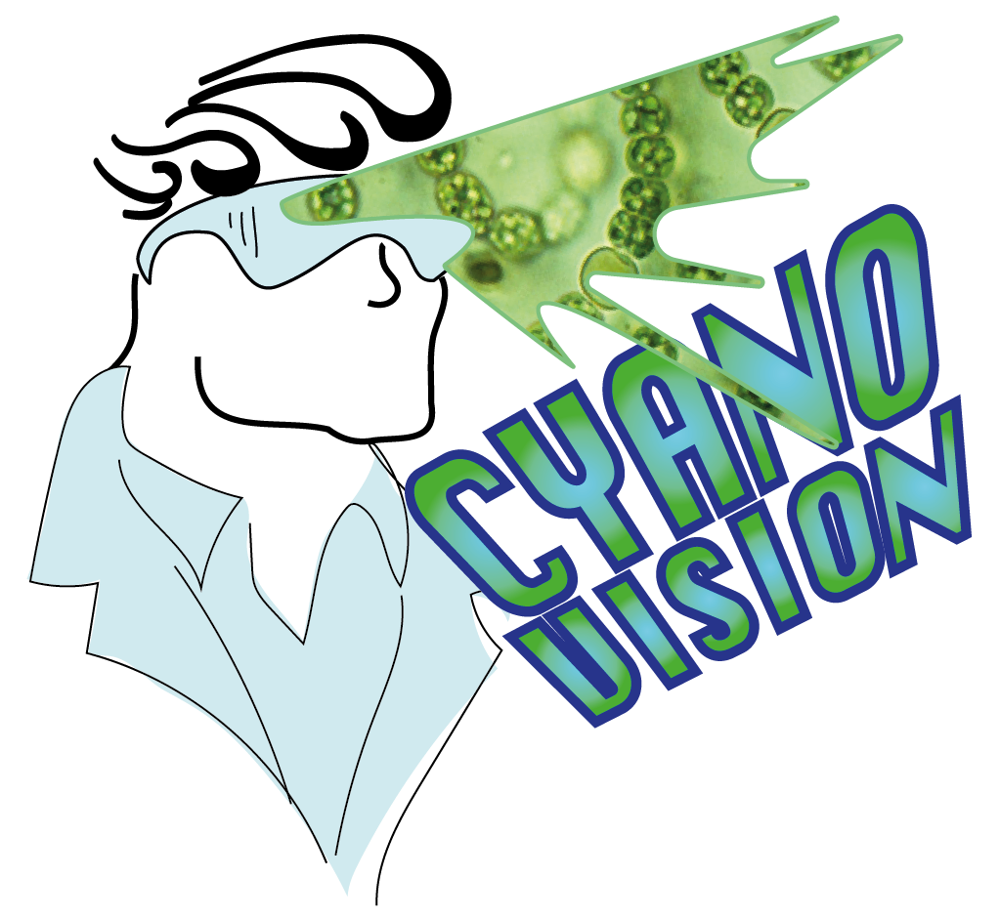

# Cyantist
[Cyanovision website](https://www.cyantist.xyz/)

## installation instructions

The installation requires the creation of venv and Flask installation dependencies. The instructions use Python3.

To install virtualenv run:
`pip install virtualenv` 

### create a venv
`python -m venv venv` 

### launch venv
`source venv/bin/activate` 

### install dependencies
`pip install -r requirements.txt` 

### launch Flask
`python -m flask run`     

### exit
`ctrl-c` 
`deactivate` 
